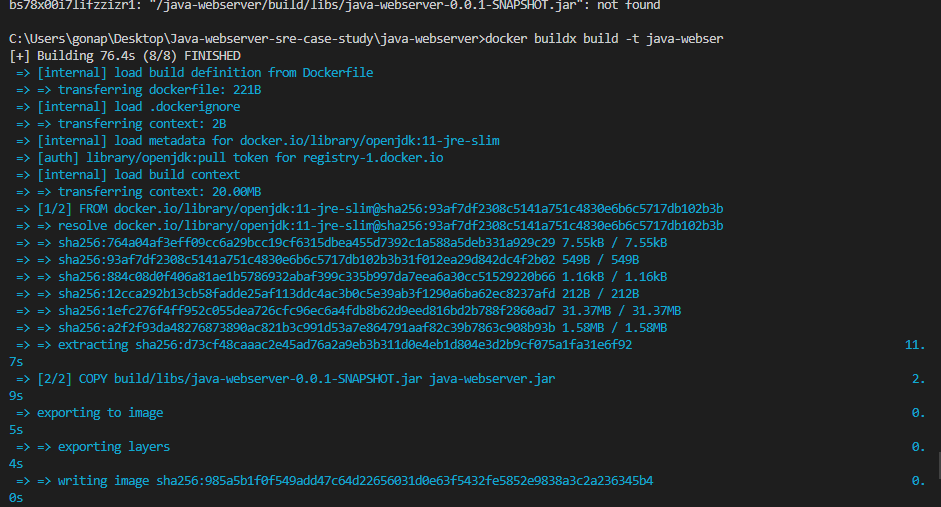
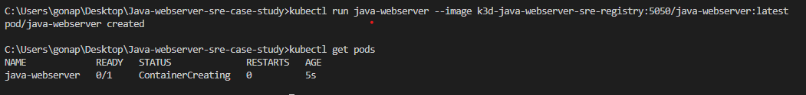
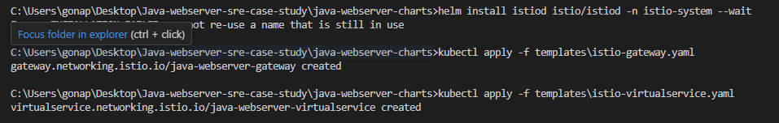
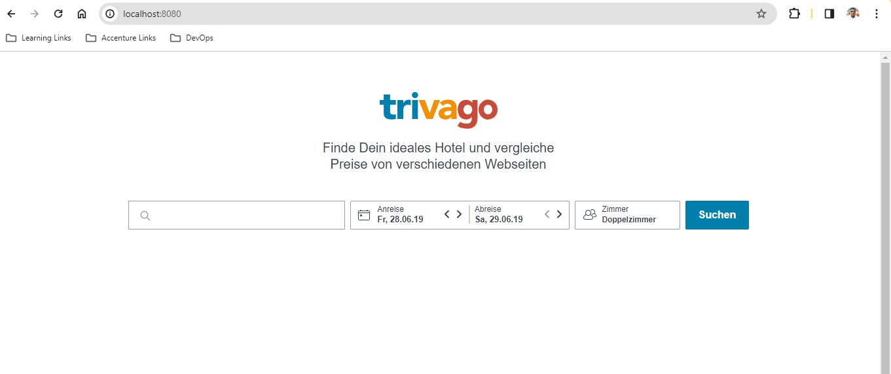
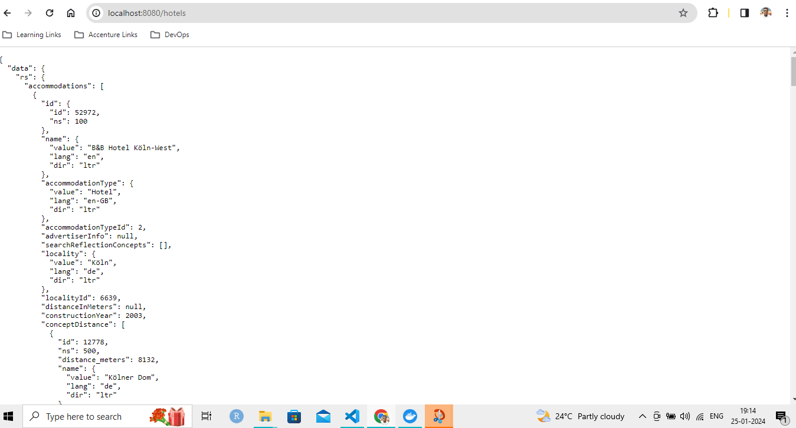
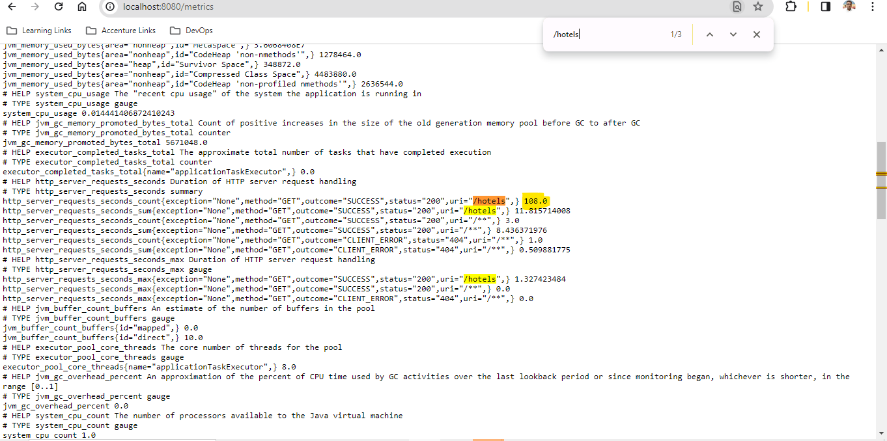

****Deployment of Java Microservice on Kubernetes with Istio and Helm****

Welcome to the documentation for deploying a Java microservice application that provides hotel search results. This guide outlines the steps to deploy the application on Kubernetes using Istio Service Mesh and Helm Charts.

Prerequisites
Before you begin, make sure you have the following software installed:

1. Gradle 8.5
2. Java 17
3. Docker 24.0.7
4. Kubernetes 1.28.2
5. K3d for local Kubernetes setup

****Setup Instructions****
**Gradle Installation**
Download and install Gradle from the official website: Gradle Downloads. Ensure Gradle is added to your system's PATH.

**Docker Installation**
Install Docker from the official Docker website: Docker Install.

**Kubernetes and K3d Installation**

Install K3d using Chocolatey (package manager):
```choco install k3d```

Install Helm using Chocolatey:
```choco install kubernetes-helm```

**Setting up the Environment**
After installing the required software, set up your development environment:

Unzip the file. 
Navigate to the project directory

**Deploying the Microservice**
Follow these steps to deploy the microservice on Kubernetes:

1. Build the Microservice:

 Use Gradle to build the microservice:
 ```gradle bootJar```

2. Dockerize the Application:
   Build a Docker image of your microservice:

   Add a file Dokerfile
   
   ```
   FROM openjdk:11-jre-slim
   COPY build/libs/java-webserver-0.0.1-SNAPSHOT.jar java-webserver.jar
   EXPOSE 8080
   CMD ["java", "-Xmx64M", "-jar", "java-webserver.jar"]
   ```
   This Dockerfile sets up a lightweight container with OpenJDK 11, copying the Java web server JAR file into the image, and exposing port 8080. The CMD instruction runs the server on startup.

   To build the image run ```docker buildx build -t java-webserver .```
   This will create a docker image which can be used to run a container or in kubernetes cluster.
   
   
   
    
3. Deploying Application to K3d 
   As hinted in the doc 3d is a lightweight Kubernetes Distribution that can be used to create a simple 8s cluster and it also has the ability of pushing images to local container registry.'

   3.1 Creating a Private Container Registry
      Run ```k3d registry create java-webserver-sre-registry --port 5050```
      

   3.2 Just to make it easier created the image again in the local registry 
   ```docker build -t k3d-java-webserver-sre-registry:5000/java-webserver:latest .```

   3.3 Pushed the image to local registry
   ```docker push k3d-java-webserver-sre-registry:5000/java-webserver:latest```

   3.3 Pull the image 
   ```docker pull localhost:5050/java-webserver```
   
   3.4 Create Cluster
   ```k3d cluster create my-cluster --registry-use k3d-java-webserver-sre-registry:5050```

   3.5 Run pod
   ```kubectl run java-webserver --image k3d-java-webserver-sre-registry:5050/java-webserver:latest```

   3.6 Get Pods
   ```kubectl get pods```
   
   

4. Setting up Helm charts 
```helm create java-webserver-charts  ``` 
   4.1 java-webserver-charts/values.yaml
       java-webserver-charts/charts.yaml
       java-webserver-charts/templates
       deployment.yaml
       service.yaml
       istio-gateway.yaml
       istio-virtualservice.yaml

5. Install Istio from official site
   After multiple attempts also it was kind of very difficult to figure out a way to install istio on my windows machine
   But finally used helm to spin up a istiod cluster

   ```helm repo add istio https://istio-release.storage.googleapis.com/charts```
   ```helm install isto-base istio/base -n istio-system --create-namespace```
   ```helm install istiod istio/istiod -n istio-system --wait```

   

6. Check Deployments and Services
   ```kubectl get pods```
   ```kubectl get services```

   

7. Finally after spinning up the pods we can access are microservice hich means the microservice has been deployed to Kubernetes Yeey!!!!
   ```kubectl port-forward service/java-webserver-service 8080:8080```
   

   

   

8. Now testing by running 100 requests aginst the /hotels endpoint
   It would have super easy if it were my mac but in windows its difficult
   in mac I could have simply executed this
   ```for i in {1..100}; do curl -s http://localhost:8080/hotels; sleep 0.1; done```

   But windows its new ;)

   Wrote a batch script testscript.bat
   which did the work for me, thanks to that.

   I ran about 108 requests confirmed from /metrics end point
   
   


       

   


   
